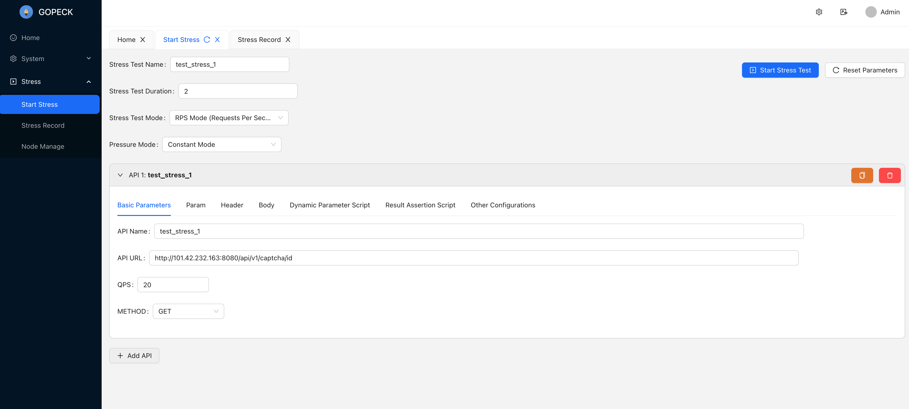
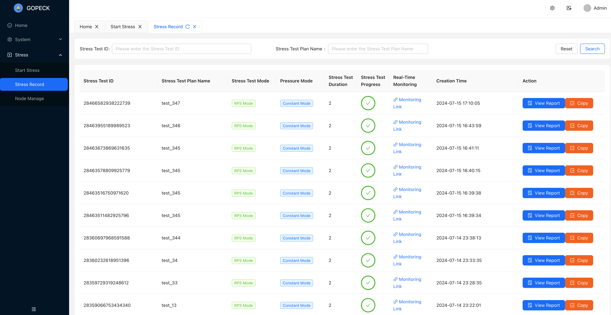
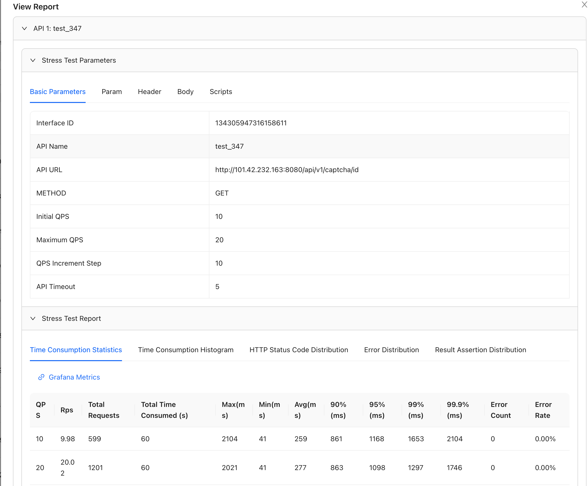
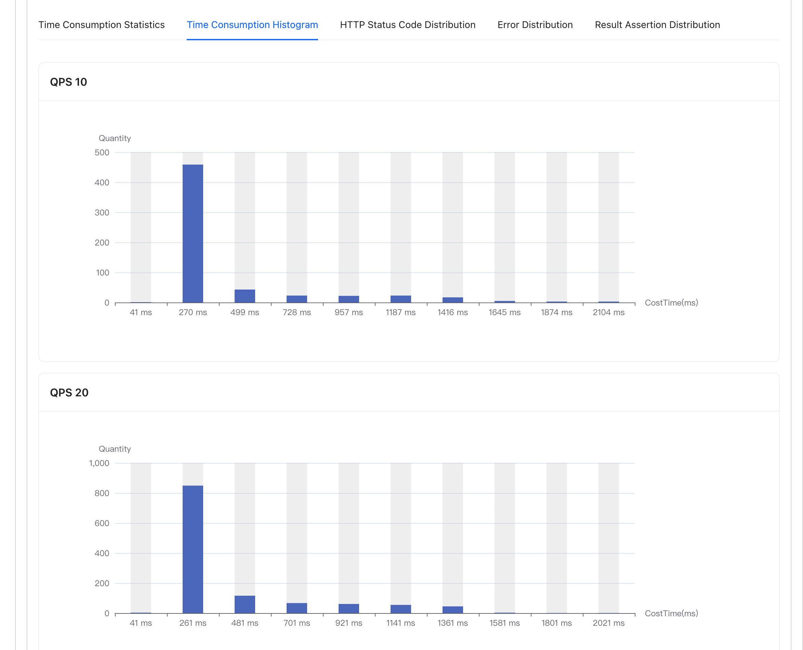
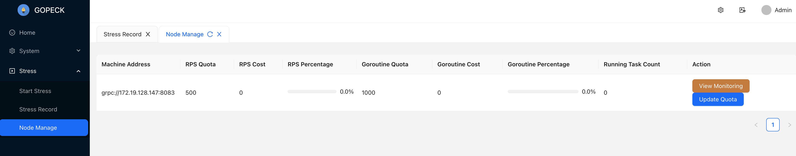
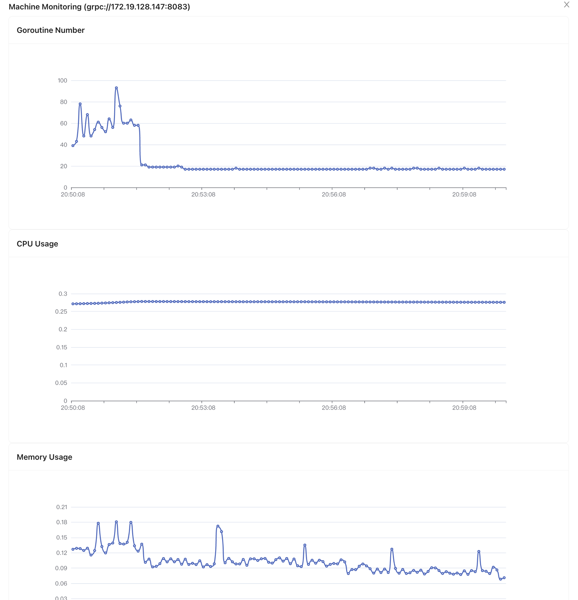
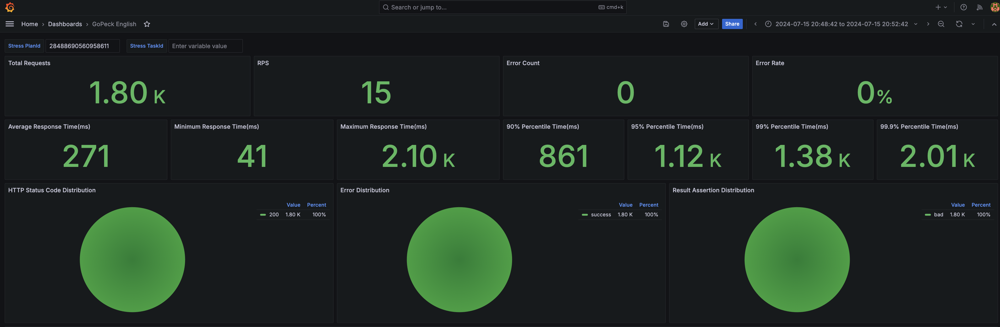
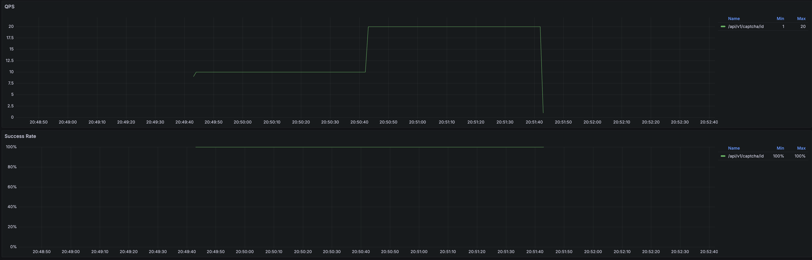
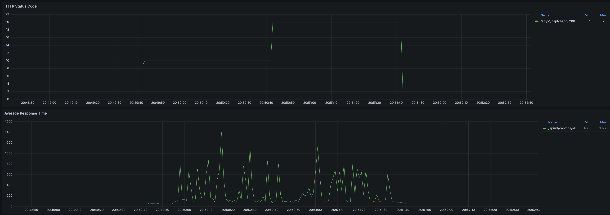
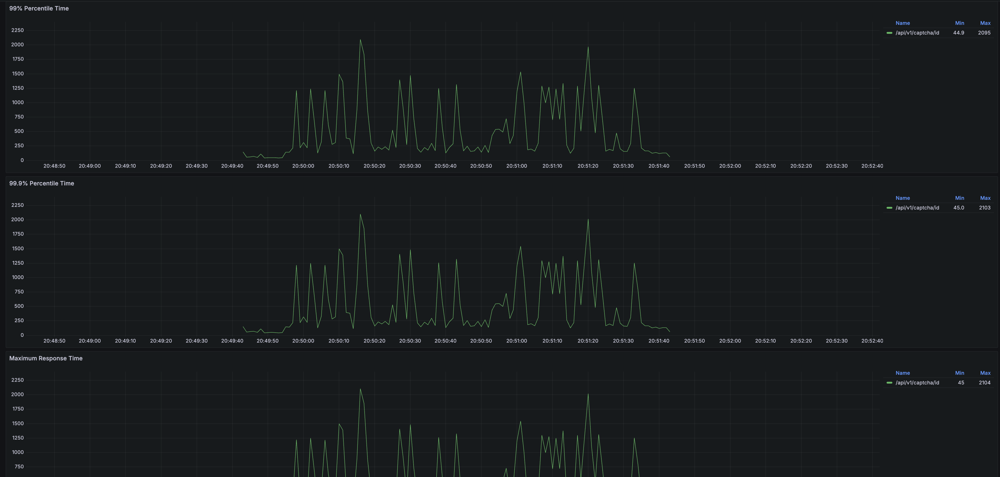

> A high-performance, scalable distributed HTTP stress testing platform based on Go, MySQL, etcd, Redis, ClickHouse, and Grafana.

English | [中文](README_ZH.md)

# 📖Introduction


# 🚀Features

Features

|      | Function                                                  | Description                                                  |
| ---- | --------------------------------------------------------- | ------------------------------------------------------------ |
| ✅    | Concurrent mode testing                                   | Fixed concurrency testing                                    |
| ✅    | QPS/RPS mode testing                                      | Ensuring specified requests per second testing mode          |
| ✅    | Distributed testing                                       | Testing agents support horizontal scaling                    |
| ✅    | Dynamic parameters                                        | Support generating dynamic random testing parameters through scripts |
| ✅    | Assertion scripts                                         | Support verifying test results through scripts               |
| ✅    | Multi-interface testing                                   | Support testing multiple API interfaces simultaneously       |
| ✅    | Support QPS/concurrency step growth                       | Support step growth testing                                  |
| ✅    | Rich reports                                              | Includes detailed reports such as time distribution, success rate, 99th percentile, error count, error rate, and corresponding real-time Grafana charts |
| ✅    | High performance, low overhead                            | Core testing logic leverages excellent projects like [hey](https://github.com/rakyll/hey) and [vegeta](https://github.com/tsenart/vegeta) with some distributed optimizations. The testing agent summarizes and reports the data points locally within 1 second. |
| ✅    | RBAC-based backend system                                 | Implemented RBAC permission management and backend operation pages based on [gin-admin](https://github.com/LyricTian/gin-admin) for easy use |
| ✅    | Machine management and monitoring, quota-based allocation | Provides testing machine agent management and monitoring pages, and controls the pressure distribution ratio of each testing agent by modifying quotas |

Initiate testing:



Testing records:




Report:





Testing machine management/monitoring:





Grafana reports:









# 🛠Getting started

## Docker-compose deployment

First, install Docker on your machine, then execute the following commands:

```
git clone github.com/peckfly/gopeck
cd deploy
docker compose up --build
```

The default Docker directory is stored at `~/tmp/docker-data`, and the default middleware password is `happy123`. You can modify these in the `deploy/.env` file.

```
DOCKER_DATA_PATH=~/tmp/docker-data # docker compose db/redis/etcd/clickhouse data store path, modify this path if necessary
MYSQL_ROOT_PASSWORD=happy123
ETCD_ROOT_PASSWORD=happy123
REDIS_PASSWORD=happy123
CLICKHOUSE_PASSWORD=happy123
GRAFANA_ADMIN_PASSWORD=happy123
```

After execution, access `localhost:8080`.

## Local IDE startup

1. First, navigate to the project root directory and start the corresponding MySQL, Redis, etcd, etc. (if you need to modify the Docker directory and password, change the `.env` file in the root directory).

```
docker compose up
```

2. Sequentially execute the generate_tables.go, generate_menus.go, and three main files in the cmd directory, specifying the configuration files and environment variables.

 Specify configuration file parameters:

```
-f configs/config-admin.yaml  // gopeck-admin / generate_menus / generate_tables
-f configs/config-integrator.yaml  // gopeck-integrator
-f configs/config-pecker.yaml  // gopeck-pecker
```

Specify middleware environment variable addresses:

```
DB_ADDR=127.0.0.1:3306;ETCD_ADDR=127.0.0.1:2379;REDIS_ADDR=127.0.0.1:6379;CLICKHOUSE_ADDR=127.0.0.1:9000
```


Running the web project

```
cd web/gopeck-web
npm install 
npm run dev
```

