> 基于go + mysql + etcd + redis + clickhouse + grafana 的一个高性能、可扩展的分布式HTTP压力测试平台

中文 | [English](README.md)

# 📖Introduction

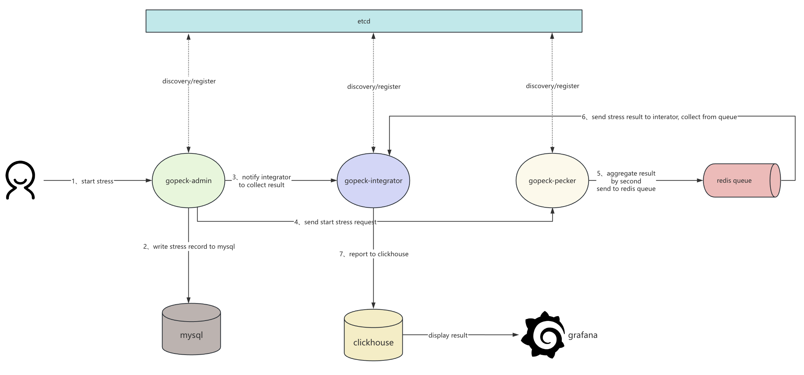


# 🚀Features

特性

|      | 功能                       | 描述                                                         |
| ---- | -------------------------- | ------------------------------------------------------------ |
| ✅    | 并发模式压测               | 固定并发数压测                                               |
| ✅    | QPS/RPS模式压测            | 保证每秒发出指定请求数模式压测方式                           |
| ✅    | 分布式压测                 | 压测agent支持横向扩容                                        |
| ✅    | 动态参数                   | 支持通过脚本生成动态随机压测参数                             |
| ✅    | 断言脚本                   | 支持通过脚本检验压测结果                                     |
| ✅    | 多接口同时压测             | 支持多个API接口同时压测                                      |
| ✅    | 支持QPS/并发数 步长增长    | 支持步长增长压测                                             |
| ✅    | 丰富的报告                 | 包含耗时分布、成功率、99线、错误数、错误率统计等丰富的报告，且还有对应的grafana实时曲线报表等 |
| ✅    | 高性能、低损耗             | 核心压测逻辑借鉴[hey](https://github.com/rakyll/hey)、[vegeta](https://github.com/tsenart/vegeta)的优秀项目代码并做了一些分布式的优化。压测 agent 会将1s 内的打点数据在本地做一次汇总统一上报 |
| ✅    | 支持RBAC权限的后台系统     | 基于[gin-admin](https://github.com/LyricTian/gin-admin)实现了RBAC权限管理和后台操作页面，使用方便 |
| ✅    | 机器管理监控、基于配额分配 | 提供了压测机器agent管理和监控页面，并给予修改配额的方式控制每个压测agent的发压占比 |

发起压测:

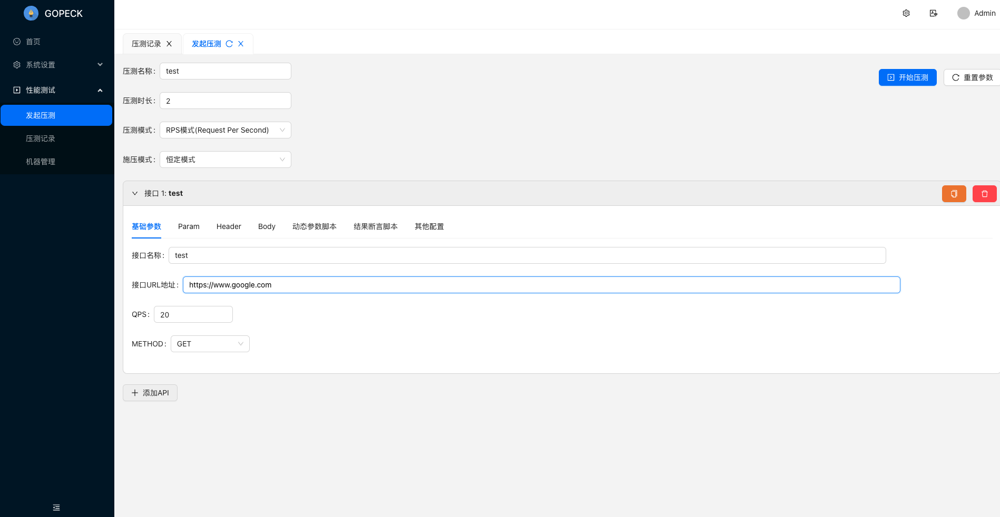

压测记录

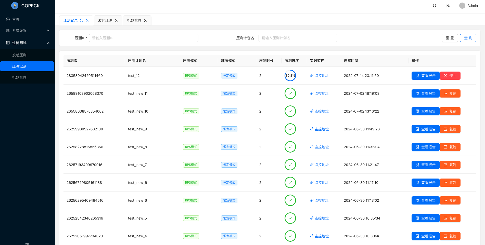

报告:

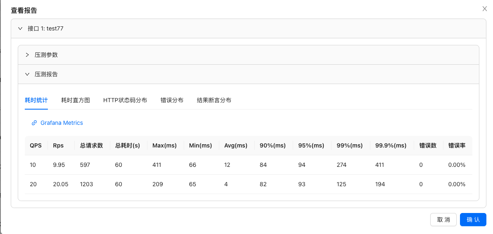

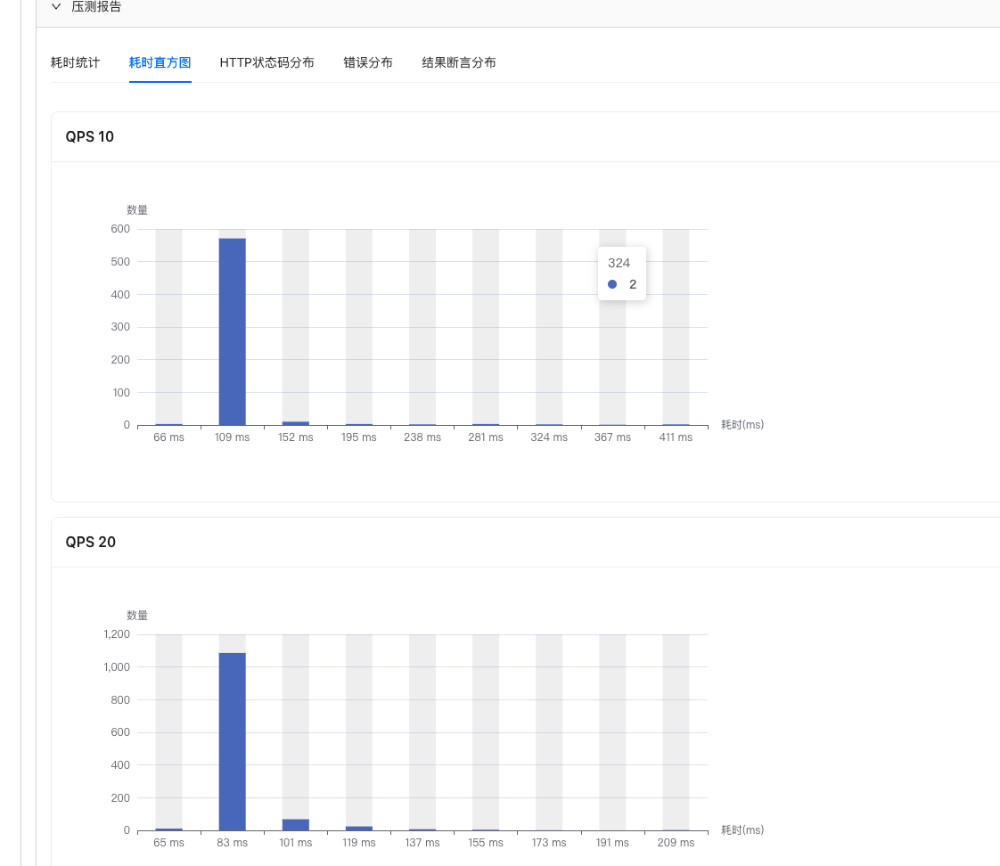

压测机器管理/监控:

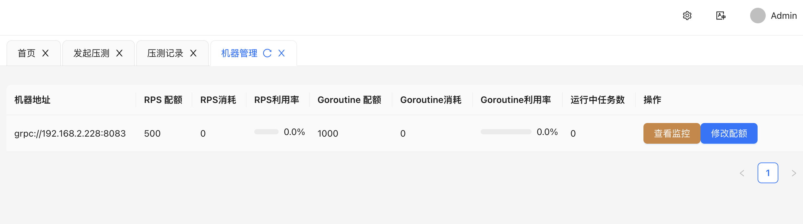

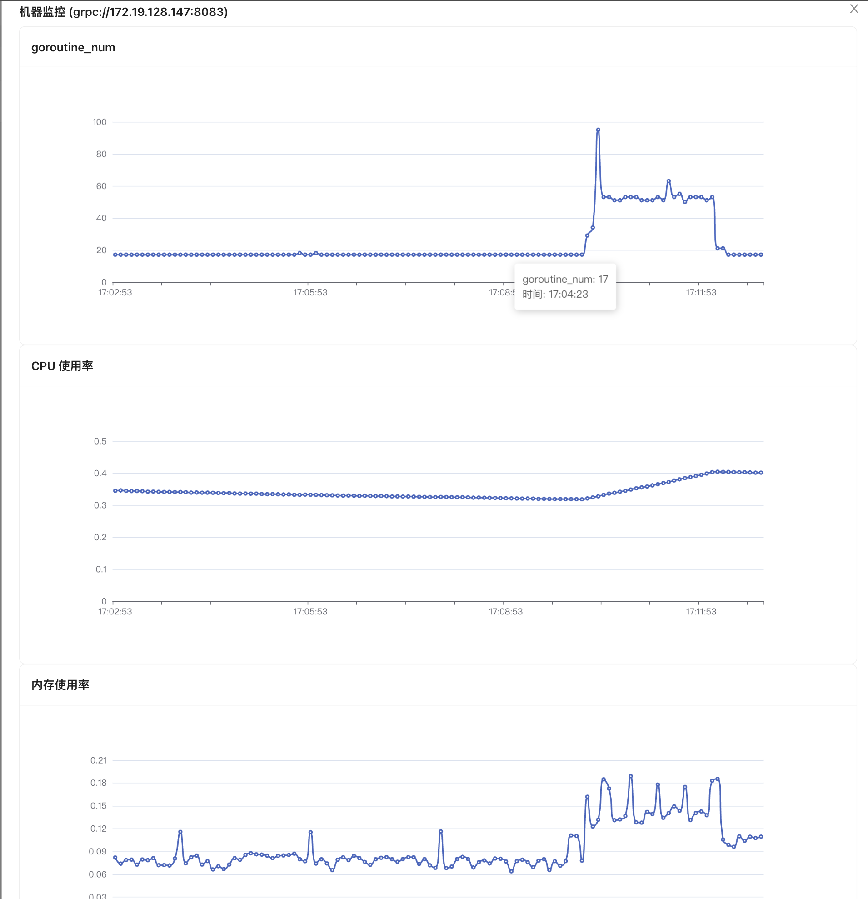

Grafana报表:

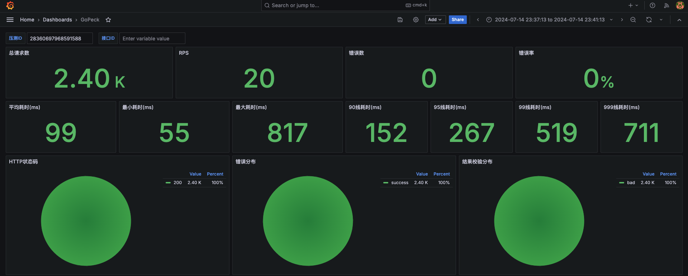

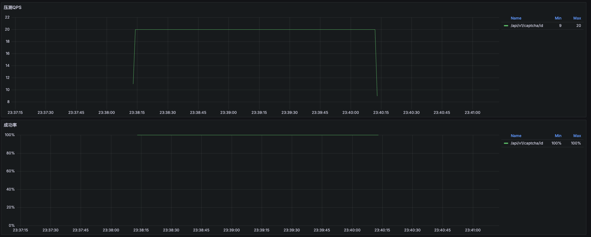

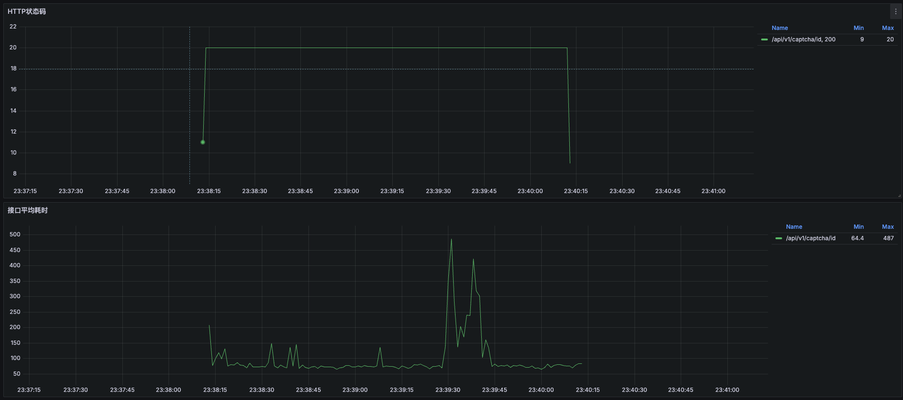

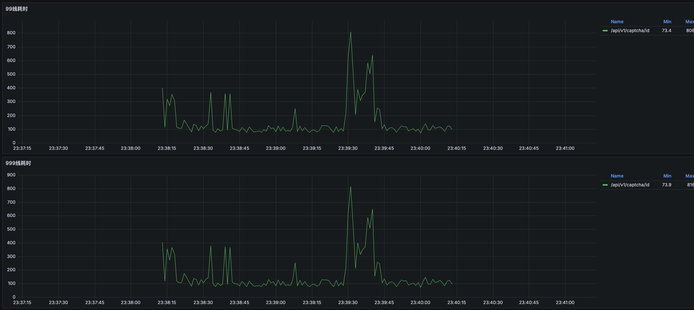


# 🛠Getting started

## docker-compose部署

先本机安装docker，然后执行如下命令:

```
git clone github.com/peckfly/gopeck
cd deploy
docker compose up --build
```

默认docker目录存放在`~/tmp/docker-data`，中间件默认密码`happy123`，可以通过`deploy/.env`文件修改

```
DOCKER_DATA_PATH=~/tmp/docker-data # docker compose db/redis/etcd/clickhouse data store path, modify this path if necessary
MYSQL_ROOT_PASSWORD=happy123
ETCD_ROOT_PASSWORD=happy123
REDIS_PASSWORD=happy123
CLICKHOUSE_PASSWORD=happy123
GRAFANA_ADMIN_PASSWORD=happy123
```

执行之后，访问`localhost:8080`

## 本地IDE启动

1、先到项目根目录下执行启动对应的mysql、redis、etcd等(如要修改docker目录和密码，修改根目录下的`.env`文件)

```
docker compose up
```

2、依次执行cmd目录下的generate_tables.go、generate_menus.go和三个main文件，注意指定配置文件和环境变量。

指定配置文件参数:

```go
-f configs/config-admin.yaml  // gopeck-admin / generate_menus / generate_tables
-f configs/config-integrator.yaml  // gopeck-integrator
-f configs/config-pecker.yaml  // gopeck-pecker
```

指定中间件环境变量地址:

```
DB_ADDR=127.0.0.1:3306;ETCD_ADDR=127.0.0.1:2379;REDIS_ADDR=127.0.0.1:6379;CLICKHOUSE_ADDR=127.0.0.1:9000
```

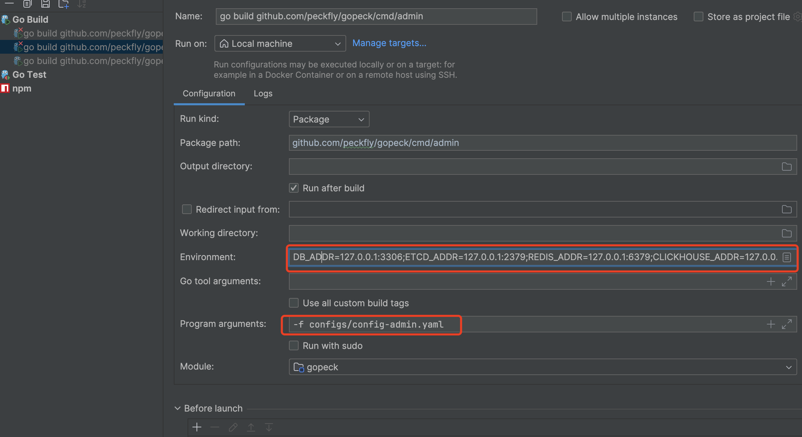

前端项目运行

```
cd web/gopeck-web
npm install 
npm run dev
```

